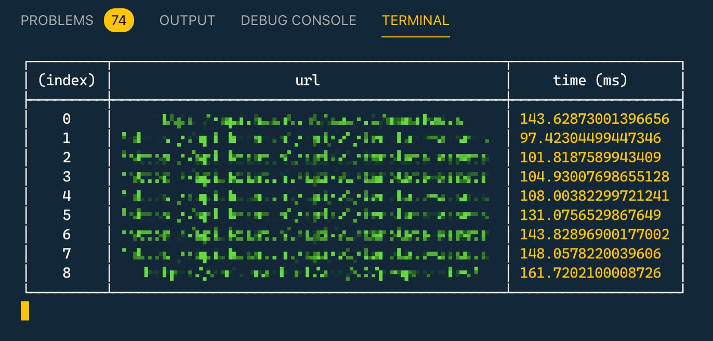

# Axios perf module

Nuxt module to log performance timings for all axios requests made during SSR.



## Usage

Include the module in your `nuxt.config.js`

```js
module.exports = {
  modules: ['nuxt-axios-perf'],
};
```

## 📑 License

[MIT License](./LICENSE)
